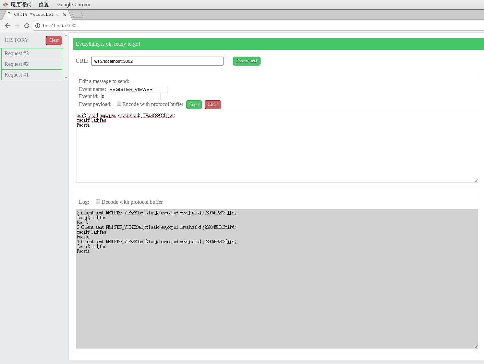

# CARTA Websocket Client
CARTA Websocket Client is a websocket tool to simulate websocket server/client for testing during development.

# ScreenShot

# Features
* Integrate protocol buffer

# Future Features
* Remember history input like some web api testing tools(postman) does.
* Create fake messages for testing. This is useful if the backend is not ready yet but you want to develop your frontend code now(going to be implemented).
* Account system, you can share the messages to your team. 

# Install && Build
### 1. Install necessary packages
> $ npm install // install dependencies

### 2. Checkout protobuf & build
> $ cd protobuf

> $ git submodule init

> $ git submodule update

> $ git checkout master

> $ ./build_proto.sh

### 3. Build & run
> $ npm run watch // you can open localhost:8080 to try it

> $ npm run build // generate build files in dist folder

> PRODUCTION=1 npm run build // build minified version of build files

> open http://localhost:8080

# License

[MIT](http://markdalgleish.mit-license.org/)
